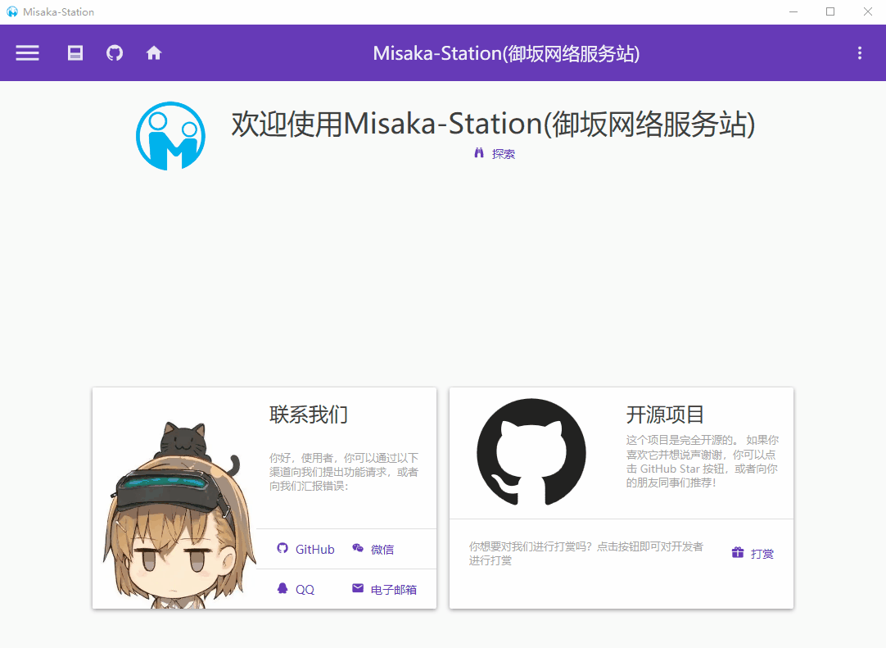
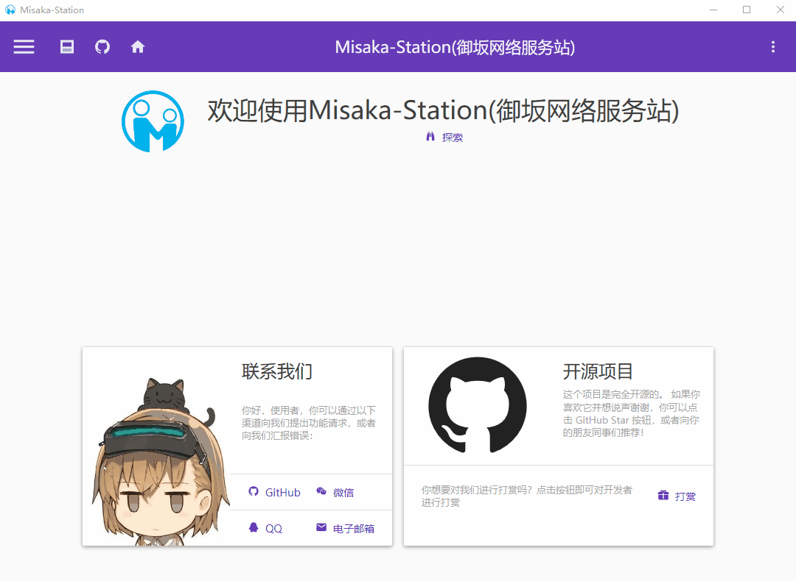
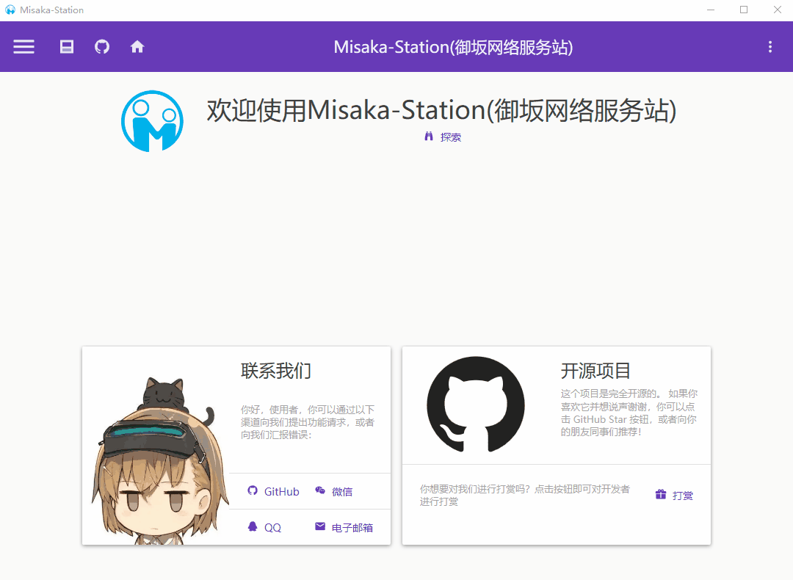
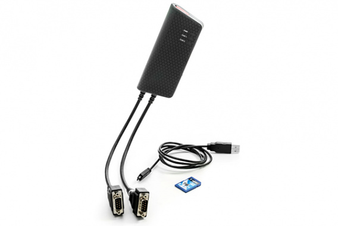
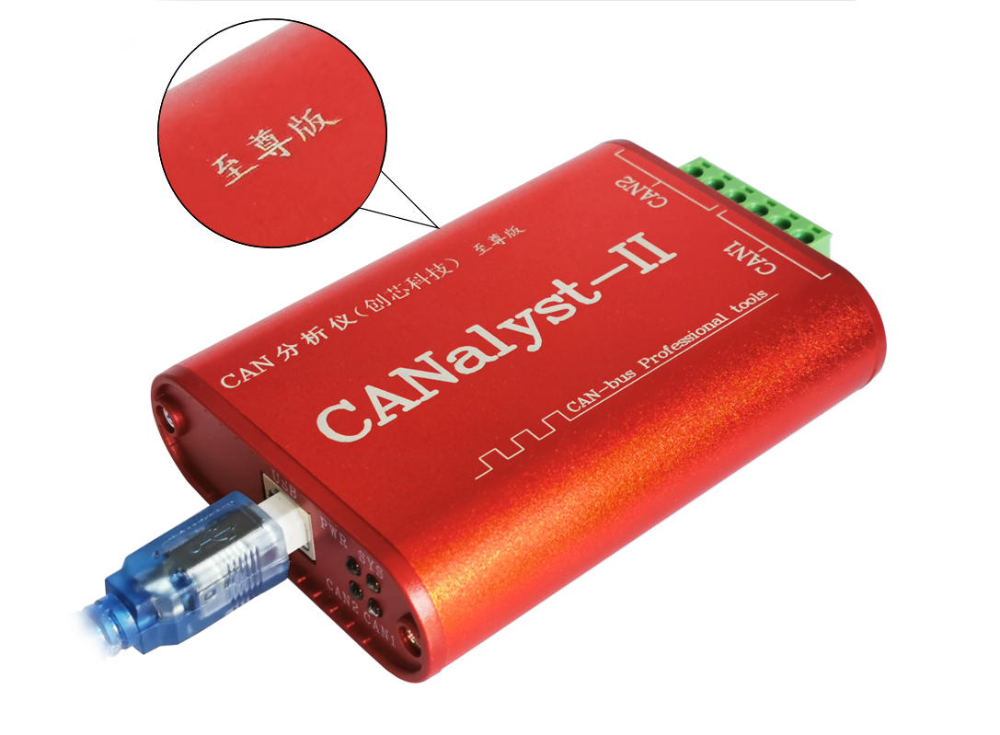

# Misaka-Station

详细信息：[【御坂网络】Misaka-Station | xqyjlj](https://xqyjlj.github.io/2021/09/10/【御坂网络】Misaka-Station/)

## 重要说明

此软件为御坂网络系列的控制台软件，基于WPF

## 界面展示

### 菜单

### 主题切换

### 页面切换

## 通讯协议

| 通讯协议                    |      |
| --------------------------- | ---- |
| 串口                        | ✔    |
| CAN（Kvaser）               | ✔    |
| CAN（珠海创芯科技有限公司） | ✔    |
| MQTT                        | ✔    |

## 串口

理论上只要电脑安装了相对应的串口驱动，所有的串口驱动均能使用。

## CAN

### Kvaser 

| 功能     |                                                              |
| -------- | ------------------------------------------------------------ |
| 收发     | ✔                                                            |
| 发送文件 | 1. 直接发送【✔】 2. 直接发送，带CRC校验【✔】 3. Ymodem【✔】 |
| 数据录制 |                                                              |

### 珠海创芯科技有限公司 

| 功能     |                                                              |
| -------- | ------------------------------------------------------------ |
| 收发     | ✔                                                            |
| 发送文件 | 1. 直接发送【】 2. 直接发送，带CRC校验【】 3. Ymodem【】 |
| 数据录制 |                                                              |

**声明**

LOGO为[免费logo在线制作-字体logo-logo设计-U钙网 (uugai.com)](http://www.uugai.com/)中设计。版权归其所有。

程序中用到的其他任何图片，除特殊声明外，版权都归其作者所有。

